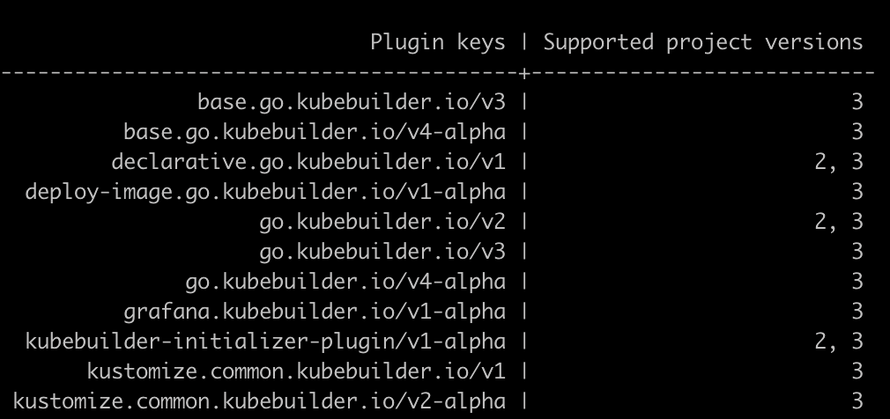

[](https://github.com/astrokube/kubebuilder-initializer-plugin/releases)
[](https://pkg.go.dev/github.com/astrokube/kubebuilder-initializer-plugin)
[](go.mod)
[](https://img.shields.io/github/license/astrokube/kubebuilder-initializer-plugin)
[](https://github.com/astrokube/kubebuilder-initializer-plugin/actions?query=workflow%3ABuild+branch%3Amain)
[](https://github.com/astrokube/kubebuilder-initializer-plugin/actions/workflows/codeql.yml)
---

# Kubebuilder Initializer Plugin

A powerful Kubebuilder plugin to initialize dynamically the structure of your kubebuilder operator repositories.

### Prerequisites

This is a plugin for the kubebuilder tool. In case of you haven't installed the tool yet, please visit the
[kubebuilder documentation](https://github.com/kubernetes-sigs/kubebuilder) and follow the instructions to get
kuberbuilder properly installed in your computer.

### Installation

#### Homebrew

#### Download the executable files

1. Visit the latest release at [Release page](https://github.com/astrokube/kubebuilder-initializer-plugin/releases)
2. Download the version that works for you
3. Extract the files in the tarball that you downloaded in the previous step
4. Copy the executable file to the path used by Kubebuilder to read the external plugins
   - OSX:  ~/Library/Application\ Support/kubebuilder/plugins/kubebuilder-initializer/v1-alpha
   - Linux: $HOME/.config/kubebuilder/plugins/kubebuilder-initializer/v1-alpha

#### Build from the code

```bash
git clone https://github.com/astrokube/kubebuilder-initializer-plugin.git
cd kubebuilder-initializer-plugin
make build install
```
To check that installation was success, please check that the executable file was copied to the folder used by Kubebuilder 
to read the plugins
- OSX:  ~/Library/Application\ Support/kubebuilder/plugins/kubebuilder-initializer/v1-alpha
- Linux: $HOME/.config/kubebuilder/plugins/kubebuilder-initializer/v1-alpha

## Getting started

To deep dive into how Kubebuilder deals with external plugins you can visit the following article 
[Extensible CLI and Scaffolding Plugins - Phase 2](https://github.com/kubernetes-sigs/kubebuilder/blob/master/designs/extensible-cli-and-scaffolding-plugins-phase-2.md)

Once you have installed the plugin you can use the Kubebuilder cli as usual. 

1. Check that the plugin has been installed correctly

```bash
kubebuilder help
```

And the `kubebuilder-initializer-plugin/v1-alpha` is displayed as part of the list of available plugins.



2. Decide which template you would like to use for creating the folder structure of your Kubebuilder operator. You can 
create your own template as described (here]() or alternatively you could take advantage of some of the well-known templates
that you can find in [AWESOME_TEMPLATES.md](AWESOME_TEMPLATES.md)

3. Initialize your project. Keep in mind that this plugin is used exclusively to initialize our project structure, so we should
use also a plugin that supports aPI and webhook creation,for instance the `go.kubebuilder.io/v3` that is prpvided out
of the box by Kubbebuilder.

```bash
kubebuilder init  --plugins go.kubebuilder.io/v3,kubebuilder-layout/v1-alpha \
  --from "github.com/astrokube/kubebuilder-operator-template" \
  --domain testing \
  --repo github.com/astrokube/k8s-testing-operator --owner astrokube;
```


## Contributing

Visit the [CONTRIBUTING.md](CONTRIBUTING.md) file.